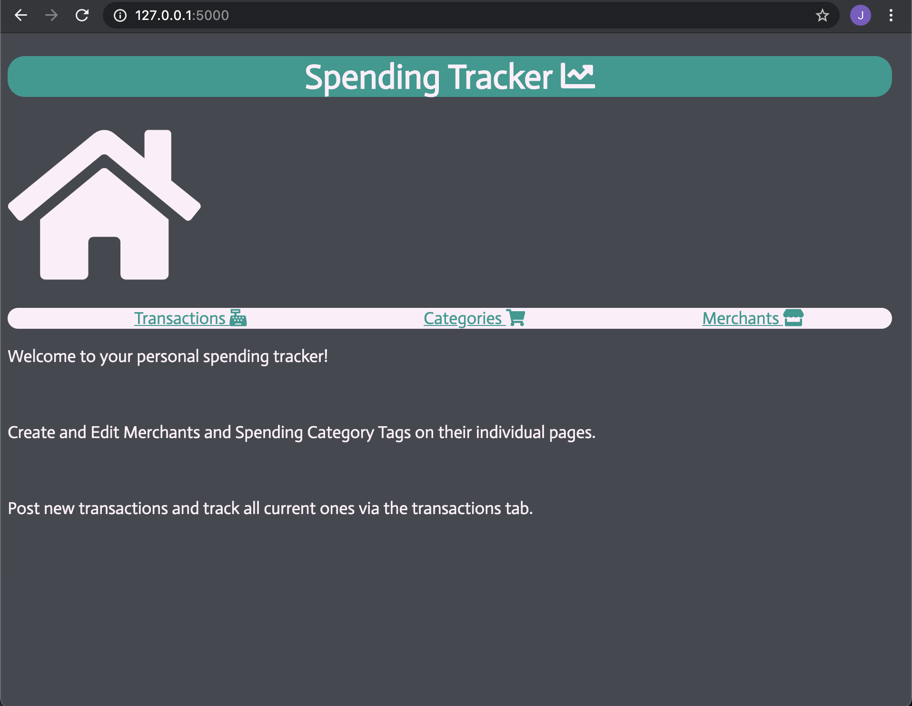

### To run this App
 ensure you have flask and psycopg2 installed on your machine

 the database it runs off is called spending_tracker

 use psql -d spending_tracker -f db/spending_tracker.sql to drop and create the tables in the database

 ensuring you are inside the app in your terminal run python3 console.py to populate the tables with some basic starting info

 to run and view on a browser use "flask run" in the terminal and go to local host 5000 in the browser.

 it should look like this :

 
The brief i was given was :

### Spending Tracker

Build an app that allows a user to track their spending.

#### MVP

* The app should allow the user to create and edit merchants, e.g. Tesco, Amazon, ScotRail
* The app should allow the user to create and edit tags for their spending, e.g. groceries, entertainment, transport
* The user should be able to assign tags and merchants to a transaction, as well as an amount spent on each transaction.
* The app should display all the transactions a user has made in a single view, with each transaction's amount, merchant and tag, and a total for all transactions.

The rules were to use only Python, Flask, HTML and CSS
no JavaScript and no CSS libraries.